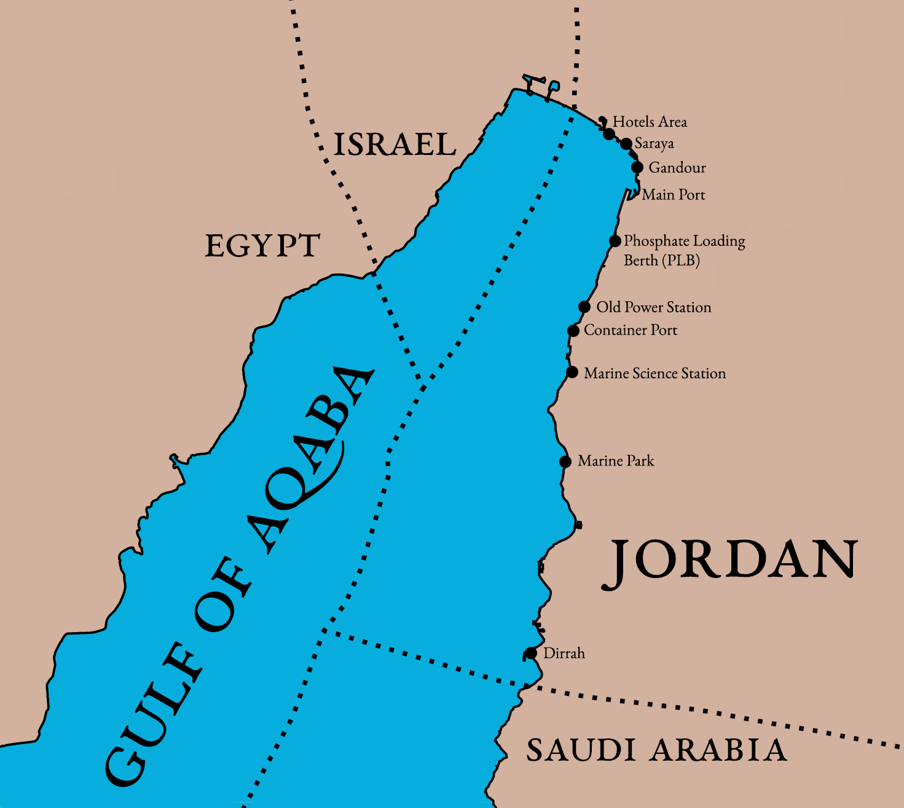

```{r  options, echo = FALSE}
library(knitr)
opts_chunk$set(tidy = TRUE, echo = FALSE, message = FALSE, warning = FALSE, 
    results = "hide") # options to make sure code doesnt display in final report
options(scipen = 999) # Ensures numbers dont display in scientific notation

```

```{r libraries}
library(readxl)          #reading the spreadsheet
library(lubridate)       #useful for dealing with dates, times
library(tidyr)           #reshape data
library(dplyr)           #manipulate data
library(splitstackshape) #Used for the 'Gear' data
library(dtplyr) 
library(ggplot2)         #Creating Graphics
library(viridis)         #Colors for graphs
library(cowplot)         #Combine multiple plots into one image
library(gridExtra)
library(grid)
library(ggrepel)
```

```{r import}
# # Import Data
# #Final_Data_Ehab_Feb_2015_Final <- read_excel("C:/Users/nealv/OneDrive/Summer 17/JREDS/Data from Usb 6-6-17/Final Data_Ehab_Feb_2015_Final.xlsx", 
#     sheet = "Sheet1")
# 
# #Fishery_Project_2nd_Year <- read_excel("C:/Users/nealv/OneDrive/Summer 17/JREDS/ecol Data Analysis/Fishery Project 2nd Year.xlsx", 
#     col_types = c("numeric", "numeric", "numeric", "numeric", "text", "text", "text", 
#         "text", "text", "numeric", "numeric"), na = "n.a.")
# 
# #ecol <- Fishery_Project_2nd_Year  #Good to leave the original untouched
# # ecol <- Final_Data_Ehab_Feb_2015_Final
# 
# # 2
# #names(ecol) <- c("Year", "Month", "Day", "Depth", "Scientific_Name", "Family", "Common_Name", 
# #    "Gear", "Fishing_Area", "Number_of_Specimens", "Weight_Kg")

```

```{r appImport}
ecol <- read_xlsx(params$data)
```

```{r Cleaning}
# Cleaning some data to make it more usable ######################
names(ecol) <- gsub(" ", "_", names(ecol))

ecol$Gear <- gsub("s", "", ecol$Gear)
ecol$Gear <- lapply(ecol$Gear, tolower)

ecol$Number_of_Specimens <- as.numeric(ecol$Number_of_Specimens)

ecol$Family <- gsub(ecol$Family, pattern = "\\s+", replacement = "")
ecol$Common_Name <- gsub(ecol$Common_Name, pattern = "[[:cntrl:]]+", replacement = "")
ecol$Fishing_Area <- gsub(x = ecol$Fishing_Area, pattern = "[oO]pposite\\s+(to\\s)?", 
    replacement = "")

# A function to create a 'datetime' column, or just date if time is unavailable ######
readDatetime <- function(df) {
    out <- tryCatch(make_datetime(year = ecol$Year, day = ecol$Day, month = match(ecol$Month, 
        month.name), hour = hour(ecol$Time), tz = "Asia/Amman"), error = function(cond) {
        return(make_datetime(year = ecol$Year, month = ecol$Month, day = ecol$Day))
    }, warning = function(cond) {
        return(make_datetime(year = ecol$Year, month = ecol$Month, day = ecol$Day))
    })
}

ecol$datetime <- readDatetime(ecol)


# splits each gear type into its own column
ecol <- concat.split.expanded(ecol, split.col = "Gear", sep = " and |\\,|\\+", type = "character", 
    fill = 0, fixed = F)


ecol <- tbl_df(ecol)


# Remove data from Novmeber 2014 as it throws off monthly averages/analyses
ecol <- filter(ecol, datetime > ymd("2014/12/01"))

# Year and Month variable
ecol$ym <- make_date(year = year(ecol$datetime), month = month(ecol$datetime))

# column that indicates if there was any fish caught
ecol$catch <- 0
ecol$catch[ecol$Number_of_Specimens > 0] <- 1
ecol$Family[ecol$catch == 0] <- "No Catch"


#Families2 only includes major families
ecol$family2 <- "Other"
ecol$family2[ecol$Family == "Clupeidae"]      <- "Clupeidae"
ecol$family2[ecol$Family == "Carangidae"]     <- "Carangidae"
ecol$family2[ecol$Family == "Scombridae"]     <- "Scombridae"
ecol$family2[ecol$Family == "Xiphiidae"]      <- "Xiphiidae"
ecol$family2[ecol$Family == "Istiophoridae"]  <- "Istiophoridae"
ecol$family2[ecol$Family == "Chondrichthyes"] <- "Chondrichthyes"
```

```{r graph_theme}
#A theme repeatedly used throughout the graphs in this document

theme538 = theme_bw() + #base theme
theme(
  plot.margin = unit(c(1, 0.5, .5, .3), "cm"), #pads the borders (top, right, bottom, left)
  plot.title = element_text(  #Features of the plot title
    face = "bold", 
    hjust =-.08,    #alginment of text, horizontally
    vjust = 2,      #alignment of text, vertically
    colour = "#3C3C3C", 
    size = 20),
  plot.subtitle = element_text( #Features of plot subtitle
    hjust = -0.1, 
    vjust = 2, 
    colour = "#535353", 
    size = 15),
  plot.background = element_rect( #background of the whole image
    fill = "#F0F0F0"), 
  panel.border = element_blank(), #Border of the graphed portion
  panel.background = element_rect(
    fill = "#F0F0F0"),            #just the background of the graphed portion
  panel.grid.major = element_line(#The gridlines on the graph
    colour = "#D0D0D0", 
    size = .5),
  axis.ticks = element_blank(), #No tick marks
  axis.text.x = element_text( #text on the x axis
    colour = "#3C3C3C", 
    size = 8, 
    hjust = 0.3),
  axis.text.y = element_text( #text on the y axis
    colour = "#3C3C3C", 
    size = 9, 
    vjust = 0.3),
  axis.title.y = element_text( #label on the y axis
    size = 11, 
    colour = "#535353", 
    face = "bold"),
  legend.background = element_blank(), #legend is transparent
  legend.title = element_text( #label for the legend
    size = 11, 
    colour = "#535353", 
    face = "bold")
)
```


Summary
==========================================
The majority of the commercial fish catch in Jordanian fisheries is made up of tuna, swordfish, and sardines. These migratory, pelagic species are unlikely to have built a separate population in Jordan or the Gulf of Aqaba and are most likely part of the broader Indian Ocean stocks. While the swordfish stock in the Indian Ocean is not currently over-fished, no stock assessments exist for the other major species.

In contrast, the reef fish species, which make up only a small part of the catch, have likely formed a separate local population. Although more comprehensive and detailed data is necessary to estimate the stock size and stock status for these species, first investigations from surveys show that important indicator species are heavily over-fished and that the stocks are nearly depleted. This conclusion is supported by the finding that more than ¼ of the fishing trips are ended without any catch.

##### Page Break

Acknowledgment
==========================================
##### Page Break

Introduction
==========================================
Literature Review
-----------------------------------

###The Fishery Status in Jordan's Gulf of Aqaba --- Mohammad Al-Zibdah, Maroof Khalaf, and Nidal Odat
This study collected data from July 1999 to June 2000 on fish size and composition as well as the gear used and effort expended. Data was collected through government resources along with interviews and direct measurements with fishers. This data was then supplemented by Ministry of Agriculture documents from previous years on catch sizes. While 153 metric tons of fish were recorded for the period in question, the researchers found that the catch size would fluctuate by as much as 100 metric tons per year historically. Much of this fluctuation can be explained by non-environmental factors like stricter border control and the banning of dynamite for fishing, but heavy over-exploitation was observed for most species outside of tuna. Fishing trips would begin in the early morning around sunrise and end when either the fishers were satisfied with the catch or at sunset. Boats mostly remained along the north coastline and in Al-Mamlah Bay, where the Gulf has a biotic soft floor or seagrass beds. Deep sea fishing in the summer. The number of trips would increase in the winter when tuna populations were at their peak; in the summer catches mostly consisted of deep sea fishing for commercial species. Fishers do not utilize shellfish and other invertebrate species in the area. The Researchers found that only 60% fishers licensed in the area actually fished, possibly because the shallow water and complex topography of the ocean floor make fishing difficult in the area. The researchers also calculated CPUE, or catch per unit effort, a measure of how much fish is caught per trip.

$\text{CPUE} = \frac{\text{CA}_m}{T_m * B_y}$ Where $\text{CA}_m$ is the catch in Kg per month, $T_m$ is the average number of trips per boat per month, and $B_y$ is the average number of active boats per month. 


###Fishery Status, Growth, Reproduction Biology and Feeding Habit of Two Scombrid Fish from the Gulf of Aqaba, Red Sea (2007) --- Mohammad Al-Zibdah and Nidal Odat
Zibdah and Odat used surveys and physical analysis to determine the characteristics of two important fish species in the Gulf of Aqaba: *Katsuwonus pelamis* (Skipjack Tuna, *Arabic Name*) and *Euthnnys affinis* (mackerel tuna, *Arabic Name*.) They found that these two species together make up about 60% of the total catch from Aqaba and that the Scombridae family in general made up 91% of the catch from about 50 trips each day. Catch totals were estimated from monthly records kept by authorities. Some of the catch of each species was also analyzed by the researchers to determine physical and behavioral characteristics. Physical characteristics of the fish indicated that only mature fish migrated into the area and that the quality and abundance of food were inadequate. The bulk of each species' consumption comes from other small fish, often *Atherinomorus lacunosus*. The rates of mortality revealed that both species are being heavily exploited by fishers, at roughly equal rates. Movement patterns also indicated that the population crosses international boundaries, making proper management between countries vital to ensure the sustainability of the fishery. 

###Fish Fauna of the Jordanian Coast, Gulf of Aqaba, Red Sea (2004) --- Maroof Khalaf
Khalaf aimed to take an inventory of the fish present in the Gulf of Aqaba and display the diversity found in the region. This study found a total of 507 fish species belonging to 109 families, 65 of which (12.8%) were endemic to the Gulf. Inventories were obtained from 4 sources: species collected or deposited at the Marine Science Station in Aqaba, the collection of the Sencknberg Museum Frankfurt, the catch of fishers between 1995 and 2002, and previous species reported in literature about the Gulf. Fish were photographed and measured by marine station staff, both after being caught and in their habitats during a visual census. The Gulf showed a high level of diversity despite its small size, potentially due to the presence of various environments like sandy flats, coral reefs, and seagrass meadows. 51% of the species lived in coral and boulders while 8.3% lived in the sea grass. Two species had also migrated into the Gulf from the Mediterranean Sea, and three invasive species were observed from inland aquaculture projects. In total, 76 species were identified as present in the Gulf for the first time. 

###Fish Assemblages in seagrass habitat along the Jordanian coast of the Gulf of Aqaba (2012) --- Maroof A. Khalaf, Saber Al-Rousan, Fuad A. Al-Horani
This study surveyed three seagrass meadows in the Gulf of Aqaba, identified as the ‘Hotels Area,’ ‘Phosphate Loading Berth,' and ‘Tala Bay.’  Of 507 total species known in the Gulf of Aqaba, 132 species (26%) were identified in these seagrass areas. 19.7% of these species were from the family Labridae, and 8.33% were Pomacentridae, with the top 8 families making up 56.82% of species. In total, 37,034 fish were counted, with Lethrinidae making up 30.5%, Pomacentridae 28.7%, Serranidae 15.4%, and the top 7 families total making up 90.0%. The study also found that seagrass acts as a nursery for the fish and that when there is more coral cover, more species inhabit the seagrass.    

###FAO Jordan Fishery Report (2003)
The UN Food and Agriculture Organization prepared a report in 2003 on the structure and prospects of the fishing industry in Jordan. The FAO found 85 fishermen employed on 40 boats, with a total catch from 2001 of 170t. Of the 2001 catch, 65% were tuna. The organization also found that the number of fishers had been static in over a period of years, and that developmental prospects were very limited. In 2003 domestic fishing made up a small portion of Jordanian fish consumption, at around 2%, with the vast majority coming from imports. The FAO also found limited management measures for fisheries in Jordan despite some limitations on fishing methods. Because the important commercial species in Jordan extend beyond Jordanian borders, the FAO recommends regional cooperation for marine environmental management. 

The Gulf of Aqaba; an Overview
-----------------------------------

###Location
The Gulf of Aqaba is a semi-enclosed water basin in the Middle East, extending from the northern tip of the Red Sea. It connects to the Red Sea through the Straits of Tiran, between Sinai and Tiran Island. It is opposite the Gulf of Suez, across the Sinai Peninsula. The Gulf borders four countries: Saudi Arabia, Jordan, Israel, and Egypt through the Sinai Peninsula. The Gulf of Aqaba is Jordan's only access to the ocean, as well as Israel's only access to the Red Sea. As such, the cities of Aqaba and Eilat (in Jordan and Israel respectively) occupy roles as important port cities. Other minor port cities also exist, like Taba in Egypt and Haql in Saudi Arabia.

The Gulf of Aqaba has a length of 170km, with an average width of 15km and an average depth of 800m (maximum depth 1800m.) The Jordanian coastline extends for about 27km along the Gulf. It consists of a series of embayments with a broad range of communities present in each, including rocky shore, reef flat, reef face, fore reef, sandy shore, sandy bottom and sea grass ecosystems [@RN34]. The Gulf's ecological importance stems from its location as a bridge between Africa and Eurasia. 

###Climate


###Sea Characteristics
The Gulf of Aqaba is marked by a relative lack of stormy weather, which along with mild water currents and relatively high salinity levels, provides a suitable environment for the growth of corals and countless varieties of marine-life forms. The water of the Jordanian coastline is clear, with high transparency and little wave action throughout the year. The poor freshwater influx has led to a poor supply of minerals salts and nutrients such as nitrogen or phosphorus compounds which left planktonic primary production very low. This characteristic is supported by a water temperature ranging from 21°C in winter to 27°C in summer; shallow coastal areas may reach as high as 29 °C during the warm months.

###Species Diversity

Between 161 [@RN34] and 507 [@RN9] different species of fish have been documented in the Jordanian part of the Gulf of Aqaba. These include species with possible local populations (e.g. groupers and lionfish) as well as migratory species such as tuna and swordfish. Most of the fish species present in Jordan (82.8%) are associated with benthic habitats such as corals and rocks [@RN9].

Sound data on the status of the fish stocks in Jordan has been mostly unavailable. While some investigations have been made [@RN18], no comprehensive stock assessments have been provided. 

Current status of fishing at Aqaba
-----------------------------------
###ASEZA establishment

The Aqaba Special Economic Zone Authority was established in 2001 to promote investment and tourism in the Aqaba area. ASEZA was created to provide certain tax incentives and spur development, and consequently, many large development projects have begun in and around the city. An important part of the ASEZA goals is the relocation of the main port further from the city, which could have dramatic impacts on the fisheries of the northern gulf. 

###Aqaba marine park

The Aqaba marine park was established in 1997 as a protected area, covering 7km of coastline 350m into the water. The park has different zones that allow for various levels of access, with some opened to public recreation and others closed except to permitted researchers. All zones of the park are closed to fishing, because of the presences of coral reef ecosystems in the area. The park is commonly used for diving, and about 80% of marine recreation in Aqaba takes place in the park. 

Efforts performed for fishing in the red sea
-----------------------------------
Strategic direction of Aqaba
-----------------------------------

ASEZA has outlined a master plan for future zoning of the locations in and around the city of Aqaba. In addition to the relocation mentioned above of the main port, new zones will be created for tourism, residential life, and heavy industry. The goal of the new coastal residential areas is to consolidate more scattered development, to reduce the spread of marine damage. Similarly, the industrial zone will be placed near the Saudi Arabian border, separated topographically from the coastal developments. Transportation infrastructure is also being constructed to increase access, chiefly through the expansion of the airport as well as the shift from industrial to personal transport at ports near the city. 

##### Page Break

Methods
==========================================
Mapping --- identification of fishing areas  
Semi-structured Questionnaire    

1. Fishermen
2. Local and touristic Restaurants    

Socio-economic survey  
Database establishment
  
The data gathered by JREDS between November 2014 and November 2015 is the first continuous data collection effort to cover nearly the entire commercial fishing operation in Aqaba. Data on landings, species, gear and fishing area are collected by questionnaires directly from the fishermen in the harbor (Appendix 1). The questionnaires have been developed by referencing those used by the FAO for the project “Scientific and Institutional Cooperation to Support Responsible Fisheries in the Eastern Mediterranean – EastMed” in Egypt and Lebanon. The collected data include the date, duration, location, the fishing method used and the estimated weight and number of the catch by species. The data is stored in a specially developed database hosted by JREDS and is regularly analyzed for misreporting and false entries. All catch is documented by pictures, so misidentification of species can be easily recognized.

##### Page Break

Results
==========================================
Fishing Areas
---------------------------
In order to determine the most active fishing areas in the Jordanian part of the Gulf of Aqaba, fishermen were surveyed upon return to shore. Each fisherman indicated what location he had gone to that day, and the results were aggregated to determine what places were most popular. Figure 1 displays the locations, while figure 2 displays their relative activity. The most popular locations were the Old Power Station and the nearby Container Port, with `r sum(ecol$Fishing_Area == "Old Power Station")` (`r round(100 * sum(ecol$Fishing_Area == "Old Power Station")/length(ecol$Fishing_Area))`% of total) and ``r sum(ecol$Fishing_Area == "Container Port")` (`r round(100 * sum(ecol$Fishing_Area == "Container Port")/length(ecol$Fishing_Area))`% of total) trips respectively. These locations indicated are known to have biotic, soft floors, along with seagrass beds and algal communities [@RN28]. The fishermen tend to stay near the city, with few trips taking place in areas closer to the southern border.  

```{r locmod}
#### This block calculates the relationship between CPUE and activity at a location ##


CPUE <- tapply(ecol$Weight_Kg, ecol$Fishing_Area, mean)  #The independent variable is CPUE, this line applies 'mean' to the weight at each fishing area
Freq <- table(ecol$Fishing_Area)  #The number of times each Fishing Area appears in the dataset

cpueloc <- data.frame(CPUE, Freq)  #combine into one frame

locmod <- (lm(log(Freq, exp(1)) ~ CPUE, cpueloc))  # Linear Model, where CPUE is explanatory and the natural log of Frequency is dependent
```

Catch Per Unit Effort (CPUE) was calculated for each fishing area, where $\text{CPUE}=\frac{\text{Kg. of Fish}}{\text{Number of Trips}}$ per area.

While the CPUE for each location does appear to have a positive relationship with activity, the correlation is not very strong. We expect that for every increase of 1kg of catch per unit effort in an area, trips to that location will be multiplied by `r round(exp(locmod$coefficients[2]),2)`. However, this only accounts for roughly `r round(100 * summary(locmod)$r.squared)`% of the variation in activity for the regions. 

In general, the fishermen have no access to fishing waters outside Jordan. Even inside Jordan’s boundaries, large areas are closed to fishing. For example, fishing is prohibited within 350 meters of the shore along the 4-km coast containing the Aqaba Marine Park area; fishing is also banned within 500 m of the port areas as well as south of the Tala Bay resort. Consequently, more than 65% of all fishing operations concentrate on three fishing areas off the coast.

 


```{r fishing_area, fig.width=10}

############### Plot for the relative frequency of each fishing area. Also displayes CPUE ###############

ggplot(data = ecol,    
       aes(x = reorder(Fishing_Area, Fishing_Area, function(x) length(x)), #Reorders the Locations by the number of times they appear
           label = 1)) + 
  geom_bar(aes(y = (..count..)/sum(..count..)), #Shows percentages instead of absolute values
           fill = "#0066CC") + 
  scale_y_continuous(labels = scales::percent) + #Displays with '%' sign
  labs(y = "% of all Trips", title = "Percent of Total Activity by Location", x = NULL, subtitle = "Numbers indicate CPUE for each site") +
  annotate("text",  #For the CPUE numbers
           x = (1:length(unique(ecol$Fishing_Area))), #How many labels are there? however many unique fishing areas there are
           y = 0.075, #Where along the y axis do these labels appear?
           label = sprintf("%.2f", round(tapply(ecol$Weight_Kg, reorder(ecol$Fishing_Area, ecol$Fishing_Area, function(x) length(x)), mean), 2)), #Same CPUE calculation, but reordered and rounded
           hjust = 1) +
  geom_hline(yintercept = 0,  #Thick line on the axis
             size = 1.0, 
             colour = "#535353") +
  coord_flip() + #Flips the x and y axes
  theme538 +
  theme(
    plot.margin = unit(c(1, 1, .5, .3), "cm"),
    axis.text.x = element_text(size = 11, colour = "#C8C8C8", face = "bold", hjust = 0.3)
  )
```
Figure 2

```{r}

############ Plots CPUE vs Activity, and the linear model from before ################

## Plotting the linear model requires making a prediction data frame
predf1 = data.frame(CPUE = seq(0,max(CPUE))) #Length of the prediction is from 0 to the max real CPUE
predf1$Freq = predict(locmod, predf1) #predicts Frequency using locmod linear model

ggplot(cpueloc, aes(CPUE, Freq)) + 
  geom_point(size = 3,  #geom_point is a regular scatterplot
             color = "#9A9A9A") + 
  geom_smooth( # A smooth line
    inherit.aes = F, #tells you to use a different dataframe for this geom
              data = predf1, #which frame to use
              aes(CPUE, exp(Freq)), #x value is CPUE, y value is e^Freq that was predicted
              color = 'red') +
  geom_hline(yintercept = 0, size = 1.0, colour = "#535353") +
  geom_text_repel(aes(label = Var1), nudge_y = 2, color = "#535353", fontface = "bold") + #Labels for the points, nudge so they dont overlap too much
  labs(x = "Catch per Unit Effort (kg/trip)", y = "Number of trips", title = "CPUE vs Activity") +
  theme538
```
Figure 3

```{r results= "asis"}
########## Displays the linear model as a table ##########

modtable <- summary(locmod)$coefficients  #the base table
row.names(modtable) <- c("Intercept", "ln(*CPUE*)")  #Change row names to be prettier
kable(modtable)
```

*R^2^ =  `r summary(locmod)$r.squared`*  

Table 1


Fishing Gear
--------------------------
Overall, `r 100 * round(mean(ecol$Gear_line), 2)`% of fishing trips used lines as part of their equipment, compared to `r 100 * round(mean(ecol$Gear_net),2)`% for nets and `r 100 * round(mean(ecol$Gear_cage), 2)`% for cages. Of the major fishing areas (>50 trips during the time period) only Gandour had significantly less line usage (at `r 100 * round(mean(ecol$Gear_line[ecol$Fishing_Area == "Gandour"]),2)`%) along with the Container Port (at `r 100 * round(mean(ecol$Gear_line[ecol$Fishing_Area == "Container Port"]),2)`%.) `r 100 * (1 - round(mean(ecol$catch), 2))`% of all fishing trips returned with no catch. That number is `r 100 * (1 - round( mean(ecol$catch[ecol$Gear_line == 1]), 2 ))`% for trips using lines, but jumps to `r 100 * (1 - round( mean(ecol$catch[ecol$Gear_net == 1]), 2 ))`% for nets and `r 100 * (1 - round( mean(ecol$catch[ecol$Gear_cage == 1]), 2 ))`% for cages (Figure 3).  


```{r lm}

############ New linear model, where the equipment is the explanatory factor, and weight is
############ the dependent

emod <- lm(formula = Weight_Kg ~ as.factor(Fishing_Area) + Gear_cage + Gear_net, 
    data = ecol)  # model, includes fishing_area so that equipment effects can be better isolated
s_emod <- summary(emod)$coefficients
```

Controlling for fishing location, both cages and nets are correlated with less catch weight, with cages seeing a change of `r round(emod$coefficients["Gear_cage"],2)`kg [(`r round(confint(emod)["Gear_cage",],2)`), p = `r s_emod["Gear_cage",4]`] and nets seeing a change of `r round(emod$coefficients["Gear_net"],2)`kg [(`r round(confint(emod)["Gear_net",],2)`), p = `r s_emod["Gear_net",4]`] respectively. This suggests that lines are more effective than other gear for total catch weight, providing a possible reason for their overwhelming usage over nets and cages. 

By looking at the breakdown of which species are targeted by each method, we can also see a difference in the use cases of each type of gear. Nets are used to target small fish, such as those belonging to the Carangidae, Clupeidae, and Caesionidae families, where large numbers but low total weights are caught. Meanwhile, lines are used to capture larger fish, like those in the Scombridae, Xiphiidae, Istiophoridae families, along with the Chondrichthyes. Cages were used more sparingly, mostly for fish in the Siganidae family. 

```{r gear_results, fig.width=8.5}
########## Barplot for how effective each equipment type is ########


##Sums up the number of trips in each weight category
line_catch <- c(
  sum(ecol$Weight_Kg < 1 & ecol$Gear_line == 1),
  sum(between(ecol$Weight_Kg, 1, 10) & ecol$Gear_line == 1),
  sum(between(ecol$Weight_Kg, 11, 20) & ecol$Gear_line == 1),   #Splits along the quartiles of Weight_Kg
  sum(between(ecol$Weight_Kg, 21, 40) & ecol$Gear_line == 1),
  sum(ecol$Weight_Kg > 40 & ecol$Gear_line == 1)
)

net_catch <- c(
  sum(ecol$Weight_Kg < 1 & ecol$Gear_net == 1),
  sum(between(ecol$Weight_Kg, 1, 10) & ecol$Gear_net == 1),
  sum(between(ecol$Weight_Kg, 11, 20) & ecol$Gear_net == 1),
  sum(between(ecol$Weight_Kg, 21, 40) & ecol$Gear_net == 1),
  sum(ecol$Weight_Kg > 40 & ecol$Gear_net == 1)
)

cage_catch <- c(
  sum(ecol$Weight_Kg < 1 & ecol$Gear_net == 1),
  sum(between(ecol$Weight_Kg, 1, 10) & ecol$Gear_cage == 1),
  sum(between(ecol$Weight_Kg, 11, 20) & ecol$Gear_cage == 1),
  sum(between(ecol$Weight_Kg, 21, 40) & ecol$Gear_cage == 1),
  sum(ecol$Weight_Kg > 40 & ecol$Gear_cage == 1)
)

bin <- c("No Catch", "1 to 10", "11 to 20", "21 to 40", "> 40")


gear_catch <- data_frame(line_catch, net_catch, cage_catch) %>% #all in one frame
  gather(V1) #gathers it so theyre all in the same column, not row

gear_catch$cat <- rep(bin, 3) #Which category

ggplot(gear_catch, 
       aes(x = factor(V1, levels = c("line_catch", "net_catch", "cage_catch")), 
           y = value, 
           fill = factor(cat, levels = c("> 40", "21 to 40", "11 to 20", "1 to 10", "No Catch")))) +
    geom_bar(stat = "identity", 
             position = "fill", #Fills the whole length so we see relative comparisons, not absolute
             colour = "black") + 
    coord_flip() + 
    scale_fill_brewer(name = "kg", 
                      palette = "YlGnBu", 
                      direction = -1) + 
    scale_y_continuous(labels = scales::percent) + 
    labs(x = NULL, y = NULL, title = "Catch by Gear") + 
    scale_x_discrete(labels = c("Line", "Net", "Cage")) +
    theme538 +
    theme(
      axis.line.y = element_blank(), 
      axis.ticks.y = element_blank(), 
      panel.background = element_blank())
```
Figure 4

```{r}
ecol$Gear <- unlist(ecol$Gear)  #Formatting problem

ecol$Gear <- unlist(ecol$Gear)
  gear_fam <- ecol %>% group_by(family2, Gear) %>% summarise(weight = sum(Weight_Kg), 
                                                             num = sum(Number_of_Specimens))
  gear_fam$family2 <- relevel(factor(gear_fam$family2), "Other")
  plot_weight <- ggplot(gear_fam, aes(x = family2, y = weight, fill = Gear)) + 
    geom_bar(stat = "identity") + coord_flip() + labs(x = "Family", y = "Weight (Kg)") + 
    theme538 + theme(legend.position = "none")
  plot_num <- ggplot(gear_fam, aes(x = family2, y = num, fill = Gear)) + 
    geom_bar(stat = "identity") + coord_flip() + labs(y = "Number of Specimens") + 
    theme538 + theme(axis.text.y = element_blank(), axis.title.y = element_blank())
  grid.arrange(plot_weight, plot_num, ncol = 2)
```

Species
------------------------
```{r catch_bar, fig.width=8.5}

ecol$family2 <- factor(ecol$family2, levels(factor(ecol$family2))[c(5, 2, 3, 4, 1, 7, 6)])
# ggplot(data = ecol, aes(x = ecol$ym, y = Weight_Kg)) + 
#     geom_col(aes(fill = family2), position = "stack") + 
#     scale_fill_brewer(name = "Specimen Family", palette = "Set2") + 
#     scale_x_date(date_breaks = "1 months", date_labels = "%b '%y") + 
#     theme(axis.text.x = element_text(angle = 45, hjust = 1, vjust = 1)) + 
#     labs(y = "Total Weight (kg)", x =NULL, title ="Catch Weight by Month and Specimen Family") +
#     geom_hline(yintercept = 0, size = 1.0, colour = "#535353") +
#     theme538 
```

```{r tot}
tot_weight <- sum(ecol$Weight_Kg)
tot_num    <- sum(ecol$Number_of_Specimens)

sard            <- (ecol$Family == "Clupeidae" | ecol$Family == "Carangidae")
sard_weight     <- sum(ecol$Weight_Kg[sard], na.rm = T)
sard_trip       <- sum(sard, na.rm = T)
sard_weight_ocp <- sum(ecol$Weight_Kg[sard & ecol$Fishing_Area == "Container Port"], 
    na.rm = T)

scomb        <- ecol$Family == "Scombridae"
scomb_weight <- sum(ecol$Weight_Kg[scomb], na.rm = T)
scomb_trip   <- sum(scomb, na.rm = T)

xiph_weight  <- sum(ecol$Weight_Kg[ecol$Family == "Xiphiidae"], na.rm = T)

isti_weight  <- sum(ecol$Weight_Kg[ecol$Family == "Istiophoridae"], na.rm = T)

chond_weight <- sum(ecol$Weight_Kg[ecol$Family == "Chondrichthyes"], na.rm = T)

cara        <- ecol$Family == "Carangidae"
cara_num    <- sum(ecol$Number_of_Specimens[cara], na.rm = T)
cara_weight <- sum(ecol$Weight_Kg[cara], na.rm = T)

clup        <- (ecol$Family == "Clupeidae")
clup_num    <- sum(ecol$Number_of_Specimens[clup], na.rm = T)
clup_weight <- sum(ecol$Weight_Kg[clup], na.rm = T)
```
In total, information from `r length(ecol$Day)` fishing trips was collected and analyzed. The grand total catch from `r format(date(min(ecol$datetime)), format = "%B %d, %Y")` to `r format(date(max(ecol$datetime)), format = "%B %d, %Y")` was `r round(tot_weight)` kg, made up of fffffff. Of all the fishing trips, `r round(100 * (1 - mean(ecol$catch)))`% caught no fish. The most abundant family in terms of number was Carangidae, with `r cara_num` individuals caught (`r round(100 * cara_num/tot_num)`%,) followed by Clupeidae with `r clup_num` (`r round(100 * clup_num/tot_num)`%,) together making up `r round(100 * (clup_num + cara_num)/tot_num)`% of all specimens caught. However, they make up a much smaller portion of the total catch weight over the period, at `r cara_weight`kg (`r round(100 * cara_weight/tot_weight, 1)`%) and `r clup_weight`kg (`r round(100 * clup_weight/tot_weight, 1)`%) respectively, or `r round(100 * (clup_weight + cara_weight)/tot_weight, 1)`% together. Instead, a majority of the total catch weight was made up of Scombridae with `r scomb_weight`kg (`r round(100 * scomb_weight/tot_weight)`%) followed by Xiphiidae with `r xiph_weight`kg (`r round(100 * xiph_weight/tot_weight)`%) making up `r round(100 * (xiph_weight + scomb_weight)/tot_weight)`% together.


A total of `r round(sard_weight)` kg of Sardines and Sardine-like species were caught in `r round(sard_trip)` trips. Of these, `r round(sard_weight_ocp)` kg (`r round(100 * sard_weight_ocp/sard_weight)`%) were caught opposite to the container port.
A total of `r scomb_weight` kg of tuna species were caught, in `r scomb_trip` trips. The total catch for swordfish was `r xiph_weight`kg, `r isti_weight`kg for sailfish, and  `r chond_weight`kg for sharks. In contrast, the local populations of reef fish species are making up only a small part of the catch (under 1% each), less than 1600 Kg per year. 

```{r results = "asis"}
for (m in unique(month(ecol$datetime))) {
    month <- (month(ecol$datetime) == m)
    tot_weight_month <- sum(ecol$Weight_Kg[month], na.rm = T)
    scomb_weight_month <- sum(ecol$Weight_Kg[month & scomb], na.rm = T)
    sard_weight_month <- sum(ecol$Weight_Kg[month & sard], na.rm = T)
    cat(tot_weight_month, "kg of fish were caught in ", month.name[m], ", of which ", 
        scomb_weight_month, "kg (", round(100 * scomb_weight_month/tot_weight_month), 
        "%) were Tuna species, and ", sard_weight_month, "kg (", round(100 * sard_weight_month/tot_weight_month), 
        "%) were sardine species. ", sep = "")
}
```


```{r heatmap, fig.width=8.5, fig.height=9}
heatdf <- ecol %>%
  filter(Family != "No Catch") %>%
  group_by(ym, Family) %>%
  summarise(net_weight = sum(Weight_Kg))
#heatdf$Family <- relevel(factor(heatdf$Family), "No Catch")

ggplot(heatdf, aes(x = ym, y = Family)) + 
    geom_tile(aes(fill = (net_weight)^(1/3)), width = 31) + coord_equal(ratio = 20) +
    scale_fill_viridis(option = "D", name = "Weight (kg)") + 
    geom_text(size = 4, aes(label = net_weight, color = net_weight, fontface = "bold")) + 
    scale_x_date(expand = c(0, 0), date_breaks = "1 month", date_labels = "%b '%y", position = "top") + 
    scale_y_discrete(expand = c(0, 0)) + 
    labs(x = NULL, y = "Specimen Family", title = "Catch Weight (kg) by Month and Specimen Family", caption = "Blank cell indicates 0") + 
  scale_color_gradientn(colours = c("White","white", "white", "Black", "Black"), guide = FALSE) +
  theme538 + 
  theme(
    panel.background = element_rect(fill = "#440154", colour = "#471260"), 
    panel.grid = element_blank(),
    plot.margin = unit(c(1, 1, .5, .3), "cm"),
    axis.text.x = element_text(size = 9, colour = "#3C3C3C", hjust = 0.3),
    axis.text.y = element_text(colour = "#3C3C3C", size = 9, vjust = 0.3),
    legend.position = "none"
    ) 
```


Time
-----------------
Trips are more frequent during the winter, which corresponds to the months where trips are most likely to be successful. However, the relationship with CPUE and month is less direct, which is highest in the late fall and in January. Trips are most frequent on Mondays and drop drastically on Fridays and Saturdays. The distribution of trip returns range from 11 am to midnight, with peaks times of 1 pm and 7 pm. 

```{r Time Plot}
# time = ecol %>%
#   select(datetime) %>%
#   mutate(starttime = datetime - ((rnorm(length(ecol$datetime), 7.237,  1.765)) * 3600))
# 
# 
# pop = rep(0, 8751)
# poptime = seq(from = min(time$starttime), to = max(time$datetime), by = 3600)
# i = 1
# for (t in poptime){
#   pop[i] = sum((t >= time$starttime & t <= time$datetime))
#   i = i + 1
# }
# df = data_frame(poptime, pop)

 plottot <- ggplot(ecol, aes(x = floor_date(datetime, unit = "day"))) + 
    geom_histogram(bins = 365, position = "identity", aes(y = ..density..), 
                   fill = "#0066CC") + geom_density(color = "#008950", size = 1) + 
    labs(x = NULL, y = NULL, title = "Relative Frequency of Trips") + geom_hline(yintercept = 0, 
                                                                                 size = 1, colour = "#535353") + theme_bw() + theme(panel.border = element_blank(), 
                                                                                                                                    panel.background = element_rect(fill = "#F0F0F0"), plot.background = element_rect(fill = "#F0F0F0"), 
                                                                                                                                    panel.grid.major = element_line(colour = "#D0D0D0", size = 0.5), axis.ticks = element_blank(), 
                                                                                                                                    plot.margin = unit(c(0.5, 1, 0.5, 0.3), "cm"), axis.text.x = element_text(colour = "#3C3C3C", 
                                                                                                                                                                                                              size = 8, hjust = 0.3), axis.text.y = element_blank(), plot.title = element_text(face = "bold", 
                                                                                                                                                                                                                                                                                               hjust = 0, vjust = 2, colour = "#3C3C3C", size = 20))
  plotwday <- ggplot(ecol, aes(x = lubridate::wday(datetime, label = T))) + 
    stat_count(fill = "#0066CC") + theme_bw() + geom_hline(yintercept = 0, 
                                                           size = 1, colour = "#535353") + labs(title = "Day of Week", x = NULL, 
                                                                                                y = NULL) + theme(panel.border = element_blank(), panel.background = element_rect(fill = "#F0F0F0"), 
                                                                                                                  plot.background = element_rect(fill = "#F0F0F0"), panel.grid.major = element_line(colour = "#D0D0D0", 
                                                                                                                                                                                                    size = 0.5), axis.ticks = element_blank(), plot.margin = unit(c(0.1, 
                                                                                                                                                                                                                                                                    0.1, 0.5, 0.3), "cm"), axis.text.x = element_text(colour = "#3C3C3C", 
                                                                                                                                                                                                                                                                                                                      size = 8, hjust = 0.5), axis.text.y = element_blank(), plot.title = element_text(face = "bold", 
                                                                                                                                                                                                                                                                                                                                                                                                       hjust = 0, vjust = 2, colour = "#3C3C3C", size = 12))
  plotmonth <- ggplot(ecol, aes(x = ym)) + stat_count(fill = "#0066CC") + 
    theme_bw() + scale_x_date(date_breaks = "2 months", date_labels = "%m/%y") + 
    geom_hline(yintercept = 0, size = 1, colour = "#535353") + labs(title = "Month", 
                                                                    x = NULL, y = NULL) + theme(panel.border = element_blank(), panel.background = element_rect(fill = "#F0F0F0"), 
                                                                                                plot.background = element_rect(fill = "#F0F0F0"), panel.grid.major = element_line(colour = "#D0D0D0", 
                                                                                                                                                                                  size = 0.5), axis.ticks = element_blank(), plot.margin = unit(c(0.1, 
                                                                                                                                                                                                                                                  0.1, 0.5, 0.3), "cm"), axis.text.x = element_text(colour = "#3C3C3C", 
                                                                                                                                                                                                                                                                                                    size = 8, hjust = 0.5), axis.text.y = element_blank(), plot.title = element_text(face = "bold", 
                                                                                                                                                                                                                                                                                                                                                                                     hjust = 0, vjust = 2, colour = "#3C3C3C", size = 12))
  plothour <- ggplot(ecol, aes(x = hour(datetime))) + stat_count(fill = "#0066CC") + 
    scale_x_continuous(limits = c(1, 24)) + theme_bw() + geom_hline(yintercept = 0, 
                                                                    size = 1, colour = "#535353") + labs(title = "Hour", y = NULL, x = NULL, 
                                                                                                         caption = "By hour of return") + theme(panel.border = element_blank(), 
                                                                                                                                                panel.background = element_rect(fill = "#F0F0F0"), plot.background = element_rect(fill = "#F0F0F0"), 
                                                                                                                                                panel.grid.major = element_line(colour = "#D0D0D0", size = 0.5), axis.ticks = element_blank(), 
                                                                                                                                                plot.margin = unit(c(0.1, 0.1, 0.5, 0.3), "cm"), axis.text.x = element_text(colour = "#3C3C3C", 
                                                                                                                                                                                                                            size = 8, hjust = 0.3), axis.text.y = element_blank(), plot.title = element_text(face = "bold", 
                                                                                                                                                                                                                                                                                                             hjust = 0, vjust = 2, colour = "#3C3C3C", size = 12))
  grid.newpage()
  lay = rbind(c(1,1),
              c(2,3))
  grid.arrange(plottot, plotmonth, plotwday, layout_matrix = lay)
```

```{r p succesful}
library(scales)
# ggplot(ecol, aes(x = datetime)) + 
#   geom_area(stat = "bin", binwidth = 86400 * 7, 
#             aes(alpha = factor(catch)), position = "fill",
#             fill = "#0066CC") +
#   scale_alpha_discrete(range = c(0,.8)) + 
#   scale_x_datetime(breaks = date_breaks(width = "1 month"), labels = date_format("%b \'%y")) +
#   scale_y_continuous(labels = scales::percent) +
#   theme_bw() +
#   labs(x = NULL, y = "Percent of Trips Successful", title = "Percent of Trips With Succesful Catch By Week") + geom_hline(yintercept = 0, size = 1.0, colour = "#535353") +
#   theme538 +
#   theme(
#     plot.margin = unit(c(1, 1, .5, .3), "cm"),
#     plot.title = element_text(face = "bold", hjust =-.08, vjust = 2, colour = "#3C3C3C", size = 20), 
#     legend.position = "none"
#     )
plot1 <- ecol %>% group_by(ym) %>% summarise(psucc = mean(catch), activity = n()) %>% 
    ggplot(aes(x = ym, y = psucc)) + geom_point(aes(size = activity), color = "#535353") + 
    scale_size_area(name = "Number of trips", max_size = 9) + geom_line(color = "#535353", size = 1) + 
    scale_y_continuous(limits = c(0, 1), labels = scales::percent) + 
    scale_x_date(breaks = date_breaks(width = "1 month"), labels = date_format("%b '%y")) + 
    theme538 + labs(x = NULL, y = NULL, title = "Percent of Trips With Succesful Catch By Month", subtitle = "Size Indicates number of Trips") + 
    geom_hline(yintercept = 0, size = 1, colour = "#535353") + 
    geom_hline(yintercept = mean(ecol$catch), linetype = "dashed") + 
    annotate("label", x = date(min(ecol$datetime)), y = mean(ecol$catch), label = "Mean = 67.9%", vjust = -0.2, hjust = -0.1, fontface = "bold", alpha = 0.5) + 
    theme(plot.margin = unit(c(1, 1, 0.1, 0.5), "cm"), plot.title = element_text(face = "bold", hjust = -0.08, vjust = 2, colour = "#3C3C3C", size = 20), 
          legend.position = "none", legend.direction = "horizontal", legend.key = element_blank(),legend.background = element_rect(fill = "#f0f0f0", color = "#E0E0E0"),axis.text.x = element_blank())
  
    plot2 <- ecol %>% group_by(ym) %>% summarise(cpue = mean(Weight_Kg), activity = n()) %>% 
    ggplot(aes(x = ym, y = cpue)) + geom_point(aes(size = activity), color = "#535353") + 
    scale_size_area(max_size = 9) + geom_line(color = "#535353", size = 1) + 
    scale_y_continuous(limits = c(0, 40)) + scale_x_date(breaks = date_breaks(width = "1 month"), 
                                                         labels = date_format("%b '%y")) + labs(x = NULL, y = NULL, title = "CPUE by month") + 
    geom_hline(yintercept = 0, size = 1, colour = "#535353") + geom_hline(yintercept = mean(ecol$Weight_Kg), 
                                                                          linetype = "dashed") + annotate("label", x= date(min(ecol$datetime)), y = mean(ecol$Weight_Kg), 
                                                                                                          label = "Mean = 23.3 kg/trip", vjust = -0.3, hjust = -0.1, alpha = 0.5) + theme538 + 
    theme(plot.margin = unit(c(0.1, 1, 0.5, 0.5), "cm"), plot.title = element_text(face = "bold", 
                                                                                   hjust = 0, vjust = 2, colour = "#3C3C3C", size = 20), legend.position = "none")
  grid.newpage()
  grid.draw(rbind(ggplotGrob(plot1), ggplotGrob(plot2), size = "last"))
```


##### Page Break

Discussion
==========================================
Fisheries and stock status
----------------------------------
As the data from the fisheries itself does not yet allow for a comprehensive assessment of the stock size and fishing status, these properties must be estimated from other sources. For the pelagic species which make up the majority of the catch, it can be assumed that no separate Jordanian population exists and that they are part of the broader Red Sea stock. Additionally, the swordfish caught in Jordan are most likely part of the Indian Ocean stock. The Indian Ocean swordfish is currently not overfished, and the biomass is close to the maximum sustainable yield threshold (BMSY). 
   
According to earlier investigations, the tuna catch mostly consists of three species. The most common are the Skipjack (*Katsuwonis pelamis*) and the Kawakawa (*Euthynnus affinis*). Minor catches consist of Yellowfin tuna (*Thunnus albacares*), Dogtooth tuna (*Gymnosarda unicolor*) and Longtail tuna (*Thunnus tonggol*) (Al-Zibdeh 2007). All of the tuna are taken from a larger migrating population, of which only a small part migrates to Jordan. The sardines and mackerels, which form another important component of the catch, are also most likely part of a bigger population in the Red Sea and not a local fish stock. Separate stock assessments for these species in the Red Sea do not yet exist.
  
In contrast to the most important commercially fished species, which are migratory and pelagic, the reef fish species which make only a small part of the landings are local populations. Although the gathered data does not yet allow for an estimation of stock size and fishing status, first conclusions can be drawn from ReefCheck Surveys, carried out by the Aqaba Marine Park during the PERSGA project in 2008 and by JREDS in 2015. These surveys focus on indicator species to give a rough estimation of important reef fish populations.
  
The snapper was selected as an indicator species because of its importance as a culinary fish that is caught by nets near reefs. Average snapper abundance for the whole region was 22.4±19.34 fish per 100 m^2^ reef, but no snappers were found in Jordan in 2006, 2008 (PERSGA 2010) and 2015 (JREDS 2015).
  
Parrotfish were selected as an indicator of over-fishing of various kinds. Between 1.25 fish per 100m^2^ reef (PERSGA 2010) and 1.8 fish per 100m^2^ reef (JREDS 2015) were found in surveys of the area. This is lower than in Egypt (2.13 fish per 100m^2^ reef) and Saudi Arabia (2.24 fish per 100m^2^ reef) (PERSGA 2010).
  
Butterflyfish of the family Chaetodontidae are taken as indicators for over-fishing (they are often bycatch in reef fisheries), ornamental fish trade and reef health. In Jordan, around 6.88±1.24 fish per 100m^2^ were counted in 2006 and 2008 (PERSGA 2010)[@RN29] and 8.9±1.33 fish per 100m^2^ (JREDS 2015), lower than in the Indo-Pacific region (10 fish per 100m^2^ reef) and Indonesia (18 fish per 100m^2^ reef). The abundances in Egypt were lower (6.23±0.69 fish per 100m^2^) and in Saudi Arabia were higher (8.22±0.36 fish per 100m^2^) (PERSGA 2010)[@RN29]. The abundance of Chaetodontid was reported as 11.75 fish per 100m^2^ reef in 5m depth and 10.40 fish per 100m^2^ reef in 1981 (Bouchon-Navaro 1981).
  
Sweetlips (*Haemulidae*) were taken as an indicator for overfishing, as they are one of the most popular fish species. In the Indo-Pacific, <1 fish per 100m^2^ were found, in Indonesia around four fish per 100m^2^. No sweetlips were found during any surveys in Jordan. 0.64±0.07 fish per 100m^2^ were found in Egypt and 1.09±0.03 fish per 100m^2^ in Saudi Arabia (PERSGA 2010)[@RN29]. 
  
Grouper above a 30cm length of any species serve as an indicator for overfishing of all types. Jordan has very low values at 0.25±0.12 fish per 100m^2^(PERSGA 2010) [@RN29] in 2006 and 2008; no grouper were found in the 2015 survey (JREDS 2015). This is in contrast to Egypt with 0.75±0.35 fish per 100m^2^ and Saudi Arabia with 1.03±0.20 fish per 100m^2^. The recorded abundance from Red Sea reefs during 1997-2001 (average: 1.15±1.3 fish per 100m^2^) and from the Indo-Pacific region was much higher (0.45±0.98 fish per 100m^2^) (PERSGA 2010) [@RN29].
  
The results of the surveys suggest that the local reef fish populations are heavily overfished. This is supported by the findings of the current fisheries data collection, which shows that for the first time about 33% of the fishermen come back from the sea without any catch.

Annual fish production in Jordan is also highly variable. Previous research has shown that production in 1999 was 450 metric tons, while production in 1998 comprised 120 metric tons [@RN29]. 2015 saw a production of `r round(sum(ecol$Weight_Kg)/1000,1)` metric tons, smaller than in previous years on record. Previous studies also do not indicate the major presence of Swordfish (Xiphiidae) in the Jordanian catch [@RN28], yet currently, Xiphiidae make up `r round(100 * xiph_weight/tot_weight, 1)`% of the catch weight. Meanwhile, the share of tuna has dropped from 60.3% in 1999/2000 to `r round(100 * scomb_weight/tot_weight)` in 2015 [@RN28]. 
  
Recommendations 
==========================================

Recommendations for Management
----------------------------------
Recommendations for Public Awareness and Education
----------------------------------
Recommendations for Research
----------------------------------

##### Page Break


Appendix I - Table of Species
==========================================
```{r setlocale}
Sys.setlocale(category = "LC_CTYPE", locale = "Arabic_Jordan")
```


```{r Species Table, results="markdown"}
library(tibble)
totkg <- sum(ecol$Weight_Kg)
totnum <- sum(ecol$Number_of_Specimens)

name_dist <- ecol %>% 
  group_by(Common_Name) %>% 
  summarise(sn = first(Scientific_Name), 
            f = first(Family), 
            kg = sum(Weight_Kg), 
            perckg = 100 * sum(Weight_Kg)/totkg, 
            num = sum(Number_of_Specimens), 
            percnum = 100 * sum(Number_of_Specimens)/totnum) %>% 
    filter(Common_Name != "No Catch")

kable(name_dist, digits = 2, 
      col.names = c("Common Name", "Scientific Name (If Available)", 
                    "Family", "Weight (kg)", "% of Total", "Number Caught", "% of Total"), 
      align = c("l", "l", "r", "r", "r", "r", "r"))
```
  
Total Number of Unique Species Identified: `r length(unique(ecol$Scientific_Name))`

#####Page Break
  
References
--------------------------------------------


